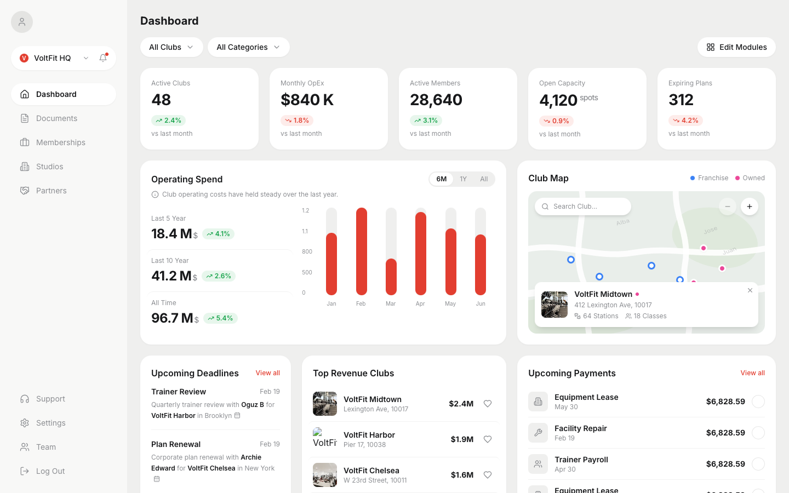

# VoltFit

[](LICENSE)
[](https://react.dev/)
[](https://vitejs.dev/)
[](https://tailwindcss.com/)

An open-source **fitness club operations** dashboard UI built with React, Vite, and Tailwind CSS. Use it as a starter for multi-location gym/studio analytics, membership ops, and partner pipelines.



## Features

- KPI cards for network metrics (clubs, operating spend, members, capacity, expiring plans)
- Operating Spend chart with multi-period summaries
- Club Map with franchise/owned pins and a detail popup
- Upcoming Deadlines for trainer reviews and plan renewals
- Top Revenue Clubs ranking and payments activity
- Pages for Documents, Memberships, Studios, Partners, Support, Settings, and Team
- Shared data contract in `src/data/dashboard.js` — swap stubs for real API data without touching components

## Tech Stack

- [Vite 5](https://vitejs.dev/) + [React 18](https://react.dev/)
- [Tailwind CSS 3.4](https://tailwindcss.com/)
- [lucide-react](https://lucide.dev/) icons
- [Inter](https://fonts.google.com/specimen/Inter) via Google Fonts

## Getting Started

**Requirements:** Node.js 18+ and npm

```bash
git clone https://github.com/kendrekaran/voltfit-dashboard.git
cd voltfit-dashboard
npm install
npm run dev
```

Open the URL printed by Vite (default [http://localhost:5173](http://localhost:5173)).

## Scripts

| Command           | Description                   |
| ----------------- | ----------------------------- |
| `npm run dev`     | Start the development server  |
| `npm run build`   | Production build to `dist/`   |
| `npm run preview` | Preview the production build  |

## Project Structure

```
├── index.html
├── src/
│   ├── main.jsx
│   ├── App.jsx                 # Shell + page routing
│   ├── index.css               # Tailwind + design tokens
│   ├── data/
│   │   └── dashboard.js        # Shared mock data contract
│   ├── components/             # Dashboard modules + UI primitives
│   └── pages/                  # Route-level screens
├── docs/                       # Screenshot + design references
├── CONTRIBUTING.md
├── LICENSE
└── package.json
```

## Customizing data

All dashboard modules read from `src/data/dashboard.js`. Replace the stub arrays/objects with API responses and leave component signatures unchanged.

## Contributing

See [CONTRIBUTING.md](CONTRIBUTING.md). Fork, branch, and open a pull request — keep components prop-free and data centralized.

## License

Released under the [MIT License](LICENSE).
