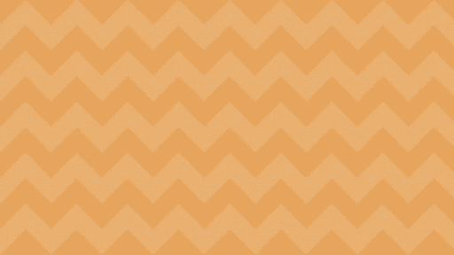
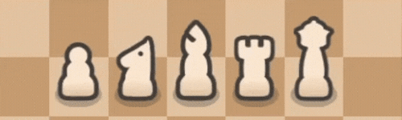
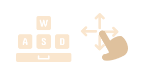

<h1 align="center">
  

  
  <!--  -->
</h1>
<!--  -->
<!--  -->

A turn-based, chess-inspired strategy game where you play as the last surviving black pawn against the white kingdom's army.

Rack up the highest score before you're overrun!

🔗 <a href="https://gabrieledradan.github.io/the-last-pawn/">Play Now on Github Pages!</a></a>

<h2><strong>Gameplay</strong></h2>

<h2><strong>Features</strong></h2>
<!-- 

 -->

<ul>
  <li>Quick turn-based strategic gameplay with a cute aesthetic!</li>
  <li>5 types of enemies based on classic chess mechanics (<i>pawns promote too!</i>)</li>
  <li>Three difficulty settings for three different experiences</li>
  <li>Responsive design, with keys and swipe controls</li>
</ul>
 

<h2><strong>Controls</strong></h2>
<ul>
  

  <li>On Desktop, use <code>WASD</code> to move in the grid and the <code>spacebar</code> to pass a turn.</li>
  <li>On Mobile, <code>swipe</code> in a direction to move, and <code>tap</code> to pass.</li>
  <li>When the bar on the top of the screen is full, you can capture an enemy piece by moving into its tile.</li>
  <li>In the Options page, you can change the <code>Difficulty</code> and toggle <code>Show Indicators</code> to show danger tiles.</li>
</ul>

<h2><strong>Built With</strong></h2>
<table align="center">
  <tr>
    <td align="center">
      
       
      React
    </td>
    <td align="center">
      
       
      Redux
    </td>
    <td align="center">
      
       
      SCSS
    </td>
    <td align="center">
      
       
      Vite
    </td>
  </tr>
</table>

<h2><strong>License</strong></h2>

This project is licensed under the <a href="LICENSE">MIT License</a>.

<h2><strong>Attribution</strong></h2>

The following logos are used in this project:

<ul>
  <li><strong>React, Redux, and Vite</strong> logos are used under the MIT license.</li>
  <li><strong>Sass logo</strong> is used under the Creative Commons Attribution-ShareAlike 4.0 License.</li>
</ul>

All trademarks, logos, and brand names are the property of their respective owners.

<h2><strong>Contact</strong></h2>

Let's get in touch: <a href="mailto:gabriel.edradan05@gmail.com">gabriel.edradan05@gmail.com</a>.

 
 
 

