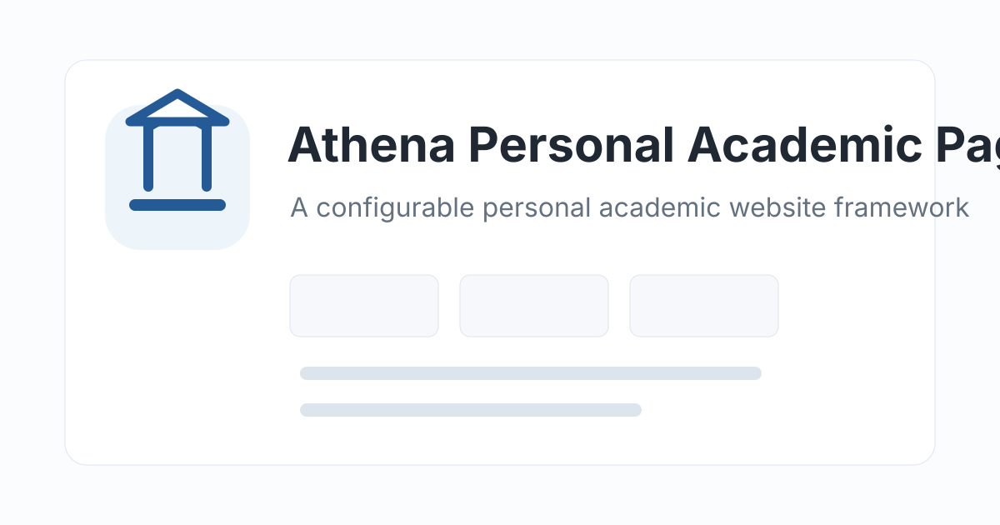

<div align="center">
  
  <h1>Athena Personal Academic Page</h1>
  <p>A clean, publication-first academic homepage for researchers.</p>
  <p>
    <a href="https://aaronz345.github.io/Athena-personal-academic-page/"><strong>View the live demo ↗</strong></a>
    &nbsp;·&nbsp;
    <a href="https://github.com/new?template_name=Athena-personal-academic-page&template_owner=AaronZ345"><strong>Use this template ↗</strong></a>
    &nbsp;·&nbsp;
    <a href="src/content/README.md">Content guide</a>
    &nbsp;·&nbsp;
    <a href="#deploy-with-github-pages">Deployment</a>
  </p>
  <p>
    <a href="https://github.com/AaronZ345/Athena-personal-academic-page/actions/workflows/pages.yml"></a>
    <a href="https://react.dev/"></a>
    <a href="https://vite.dev/"></a>
    <a href="LICENSE"></a>
  </p>
</div>

<a href="https://aaronz345.github.io/Athena-personal-academic-page/">
  
</a>

Athena is a React and Vite template for maintaining an academic website without mixing content into page components. Profiles, publications, projects, teaching, talks, awards, service, and site metadata all live in small files under `src/content/`.

## What is included

| Area | What Athena provides |
| --- | --- |
| Research profile | Compact profile sidebar, research interests, contact links, CV, Scholar, ORCID, DBLP, GitHub, and more |
| Publications | Grouped papers, featured cards, compact rows, figures, equal-contribution notes, artifact links, and automatic metrics |
| Academic activity | News, projects, teaching, talks, education, experience, awards, and service sections |
| Project links | Repository-aware action links with cached GitHub star counts and static fallbacks |
| Presentation | Responsive desktop and mobile layouts, light and dark themes, sticky navigation, and accessible image fallbacks |
| Publishing | SEO and social metadata plus a ready-to-run GitHub Pages workflow |

Section order, navigation labels, notes, and visibility are controlled from one array in `src/content/site.js`. There is no second navigation config to keep in sync.

## Start in three steps

### 1. Create your site

Click [Use this template](https://github.com/new?template_name=Athena-personal-academic-page&template_owner=AaronZ345) to create a clean repository without Athena's commit history. For a root GitHub Pages site, name it `USERNAME.github.io`.

```bash
git clone https://github.com/USERNAME/USERNAME.github.io.git
cd USERNAME.github.io
```

Keeping the repository name is also fine; GitHub Pages will publish it at `https://USERNAME.github.io/REPOSITORY/`.

### 2. Run it locally

```bash
npm ci
npm run dev
```

Open `http://127.0.0.1:5173/`.

### 3. Replace the sample content

Most users only need to edit `src/content/` and add images to `public/images/`.

| Start here | Controls |
| --- | --- |
| `src/content/profile.js` | Name, role, affiliation, avatar, contact links, research focus, and bio |
| `src/content/publications.js` | Papers, groups, venues, links, tags, figures, and featured cards |
| `src/content/site.js` | Site title, metadata, repository link, section order, labels, and visibility |
| `src/content/news.js` | News timeline |
| `src/content/projects.js` | Research projects and repository links |
| `src/content/teaching.js`, `talks.js` | Teaching and talks |
| `src/content/education.js`, `experience.js` | Education and positions |
| `src/content/awards.js`, `services.js` | Honors and academic service |

The [content reference](src/content/README.md) documents every field, including publication grouping, rich text fragments, card selection, image paths, and project layout.

For a first publish, start with `profile.js`, `publications.js`, and `site.js`. The remaining sections can stay as examples or be disabled from the `sections` array until you need them.

## Publications

Each paper uses a `group` string. Preferred group order comes from `publicationGroups` in `src/content/site.js`; groups that are not listed there still appear afterward.

Card layout is explicit:

- `featured: true` renders a large publication card.
- Missing or false `featured` renders a compact row.
- A featured paper may omit `image`; Athena then shows a generated text placeholder.
- Adding an image does not automatically make a paper featured.

Featured papers appear before compact papers within a group. Array order is preserved inside both sets.

## Sections and navigation

The `sections` array in `src/content/site.js` controls page order and the top navigation:

```js
{ id: "talks", title: "Talks", nav: "Talks", enabled: false }
```

- Set `enabled: false` to hide a section.
- Set `nav: false` to keep a section on the page but remove it from the top navigation.
- Reorder entries to reorder the page.

## Images

Store site images in `public/images/` and use paths without a leading slash:

```js
image: "images/my-paper.png"
```

That path format works for both root sites and project-page deployments. Publication figures use a `16:9` frame with `object-fit: contain`.

For `.png`, `.jpg`, and `.jpeg` publication figures, Athena requests a same-name WebP first and retains the original as a fallback:

```text
public/images/my-paper.png
public/images/my-paper.webp
```

Images already stored as `.webp` or `.svg` are used directly. See the [image guide](src/content/README.md#publication-images-and-webp) for conversion commands and favicon setup.

## Links and GitHub stats

Athena recognizes common link labels such as `Paper`, `Code`, `Dataset`, `Demo`, `Slides`, `Video`, `DOI`, `BibTeX`, `Poster`, `Documentation`, `Project`, and `Download` and assigns matching icons.

Repository links can include a static star fallback:

```js
{ label: "Code", href: "https://github.com/owner/repo", stars: 128 }
```

The fallback appears immediately. Athena refreshes it from the GitHub API when the persistent browser cache is missing or stale and keeps the last successful value if anonymous API requests are rate-limited. Stats appear on repository-style links by default; use `showGithubStats: true` to override that behavior.

## Deploy with GitHub Pages

1. Open the repository's **Settings → Pages** page.
2. Set **Build and deployment → Source** to **GitHub Actions**.
3. Update `siteMeta.url`, `siteMeta.image`, and `siteMeta.repositoryUrl` in `src/content/site.js`.
4. Push to `main`.

The included [`pages.yml`](.github/workflows/pages.yml) workflow installs dependencies, builds `dist/`, and deploys it. Vite automatically uses `/` for `USERNAME.github.io` repositories and `/REPOSITORY/` for project Pages sites.

For a custom domain, set `siteMeta.url` to that domain before deploying.

## Project map

```text
src/content/          Editable profile and academic content
src/App.jsx           Page rendering and section composition
src/icons.js          Link and section icon mappings
src/styles.css        Design system and responsive layout
src/assets/fonts/     Bundled icon fonts
public/images/        Avatars, paper figures, favicons, and social preview assets
.github/workflows/    GitHub Pages deployment
```

## Check before publishing

```bash
npm run build
npm run preview
```

Check the profile details, publication links and figures, section navigation, both color themes, and the mobile layout. Also confirm that every PNG or JPEG publication figure has its same-name WebP file.

## License

Athena Personal Academic Page is available under the [MIT License](LICENSE).
