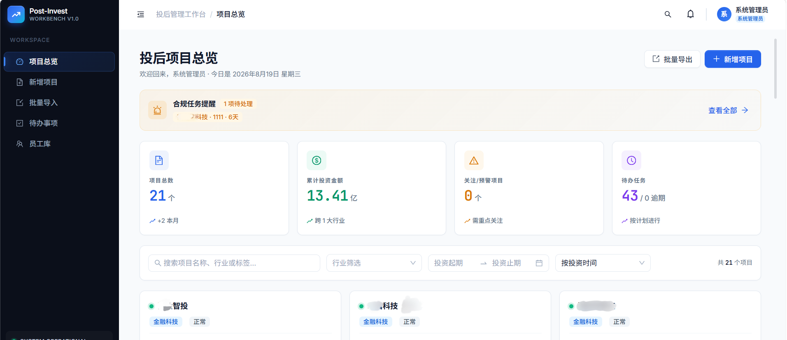
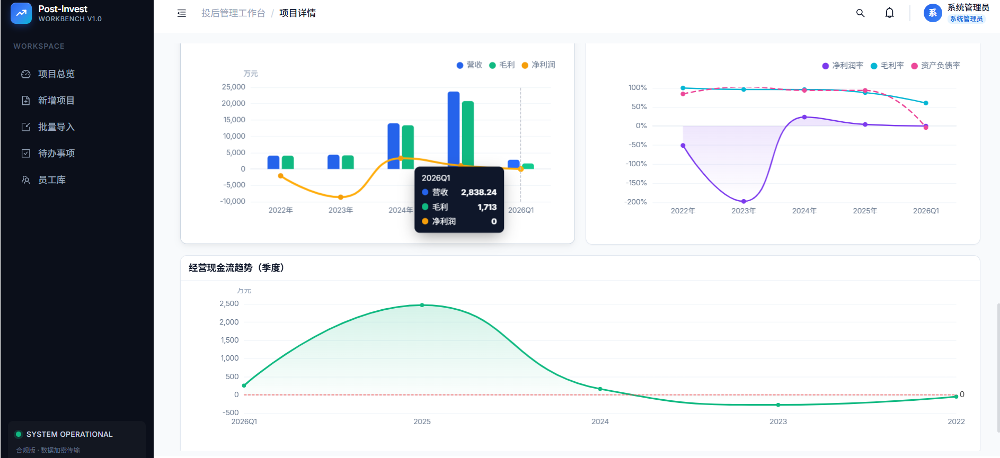
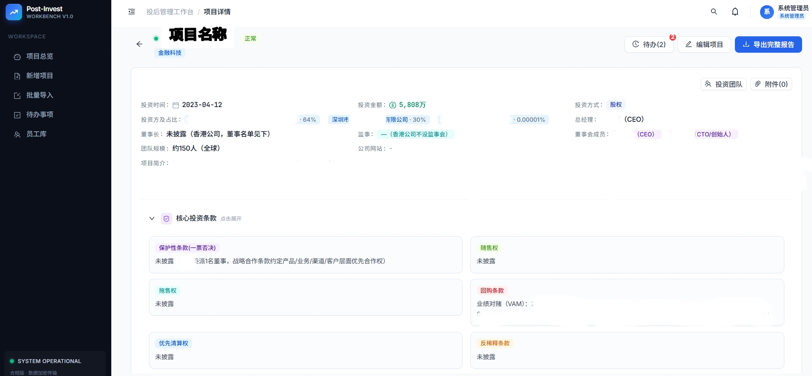
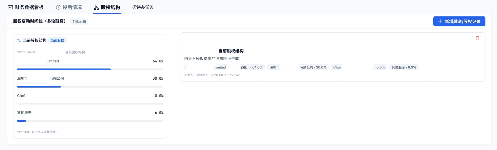
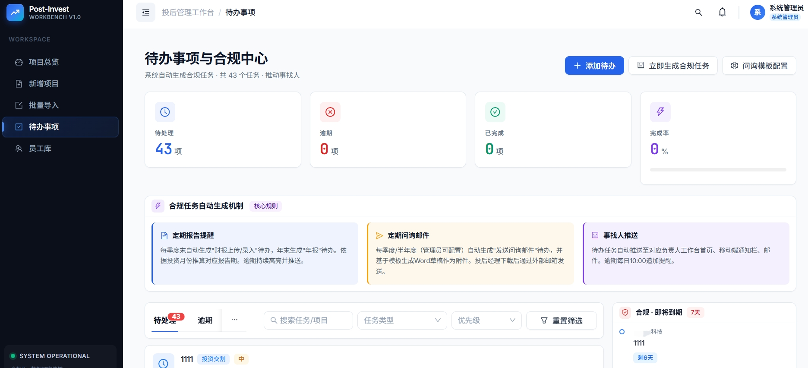

# Post-Investment Platform (投后管理工作台)

[](https://opensource.org/licenses/MIT)

一个面向投资机构的投后管理平台，覆盖项目总览、项目详情、财务看板、合规待办、报告导出等核心场景。

## ✨ 功能特性

### 📊 项目管理
- **项目总览看板** - 可视化展示所有投资项目状态
- **项目详情** - 包含概览、财务数据、时间轴三个维度
- **Excel 批量导入** - 支持多 Sheet 模板导入，覆盖股权、财务、董监高等全字段

### 💰 财务数据
- **财务看板** - 按年份+最新一期展示（年报优先，否则取最新季度/月度）
- **财报汇总** - 多公司多报表的全量大表展示
- **表单式填报** - 支持月报（YYYYMM）和年报（YYYY）的财务数据录入

### ✅ 待办事项
- **待办闭环** - 完成待办时可填写节点/过程信息，并选择是否写入投后情况时间轴
- **自定义类型** - 支持内置类型 + 自定义新增，全团队共享

### 📈 数据导出
- **DOCX 报告导出** - 项目详情和财务数据导出为 Word 文档
- **Excel 模板下载** - 提供标准导入模板

## 📸 界面预览

> 截图中的数据为演示样例，公司名称已做脱敏处理。

### 项目总览看板



### 财务数据图表



### 项目详情（概览 + 投资条款）



### 股权结构



### 待办事项与合规中心




## 🚀 快速开始

### 环境要求
- Node.js 18+
- npm

### 方式一：演示模式（最快，2 分钟跑起来）

无需任何后端配置，使用内置示例数据体验完整界面：

```bash
# 1. 克隆项目（建议克隆到纯英文路径，避免 Windows 中文路径编码问题）
git clone https://github.com/Oliveluo666/post-investment-platform.git
cd post-investment-platform

# 2. 安装依赖
npm install

# 3. 创建 .env 并开启演示模式
#    复制 .env.example 为 .env，把 VITE_DEMO_MODE 改为 true
cp .env.example .env   # Windows PowerShell: Copy-Item .env.example .env

# 4. 启动
npm run dev
```

访问 `http://localhost:3000`，登录页点击「进入演示」即可。

### 方式二：连接 CloudBase 后端（完整功能）

#### 1. 创建 CloudBase 环境

1. 开通 [腾讯云 CloudBase](https://cloud.tencent.com/product/tcb)，创建环境（选择 PostgreSQL 数据库）
2. 开启「身份认证 → 用户名密码登录」和「匿名登录」
3. 开通「静态网站托管」

#### 2. 初始化数据库

在 CloudBase 控制台 → 数据库 → SQL 执行窗口中，粘贴并执行 [`scripts/schema.sql`](scripts/schema.sql) 全文。
该脚本会创建 10 张业务表、RLS 行级安全策略、`is_admin()` 函数和内置事项类型种子数据。

#### 3. 配置环境变量

```bash
cp .env.example .env
```

编辑 `.env`，填入你的 CloudBase 配置：

```env
VITE_CLOUDBASE_ENV_ID=your-env-id           # 控制台 → 环境设置 → 环境 ID
VITE_CLOUDBASE_REGION=ap-shanghai           # 环境所在地域
VITE_CLOUDBASE_PUBLISHABLE_KEY=your-key     # 控制台 → 身份认证 → Publishable Key
VITE_DEMO_MODE=false
```

#### 4. 部署云函数（可选，注册审核等管理功能需要）

见 [`cloudfunctions/README.md`](cloudfunctions/README.md)。

#### 5. 启动

```bash
npm install
npm run dev
```

#### 6. 创建管理员账号

1. 在 CloudBase 控制台 → 身份认证 → 用户管理，手动创建一个用户名密码用户（如用户名 `admin`）
2. 在数据库 users 表中找到 `seed-admin` 记录，把 Auth 用户的真实 UID 回填到 `uid` 字段
3. 用该账号登录系统（登录时用户名填 `admin`，即邮箱 `@` 前缀）

### 构建与部署

```bash
npm run build    # 产物在 dist/
```

可部署到 CloudBase 静态托管或任意静态托管服务。部署后需配置 SPA 回退（404 → index.html），CloudBase 环境可执行一次 `setHostingFallback` 云函数完成配置。

## 🏗️ 技术架构

### 前端技术栈
- **React 18.2** + **Vite 5.x** + **Ant Design 5.x** + **Tailwind CSS 3.x**
- **React Router v6**（HashRouter）/ **ECharts** / **xlsx** / **docx** / **dayjs**

### 后端
- **CloudBase PostgreSQL**（10 张业务表 + RLS 行级安全）
- **CloudBase 身份认证**（用户名密码登录）
- **CloudBase 云函数**（注册审核、密码重置等管理员操作）

详细架构说明见 [`docs/ARCHITECTURE.md`](docs/ARCHITECTURE.md)。

## 📁 项目结构

```
post-investment-platform/
├── .env.example                # 环境变量模板（复制为 .env 后填写）
├── index.html                  # 入口 HTML
├── package.json
├── vite.config.js              # Vite 配置（含 vendor 拆包优化）
├── tailwind.config.js
├── postcss.config.js
│
├── docs/                       # 文档
│   ├── ARCHITECTURE.md         # 架构文档（数据库设计、同步机制、部署）
│   ├── 投后数据批量导入规范.md  # Excel 导入字段规范
│   └── screenshots/            # 界面截图（脱敏）
│
├── public/
│   └── extracted_data.json     # 示例数据（虚构）
│
├── src/
│   ├── main.jsx                # 入口（Antd 主题 + HashRouter + ErrorBoundary）
│   ├── App.jsx                 # 路由 + 登录守卫 + 路由级懒加载
│   ├── index.css               # 全局样式 + Tailwind
│   │
│   ├── components/             # 可复用组件
│   │   └── ErrorBoundary.jsx
│   ├── layouts/
│   │   └── MainLayout.jsx      # 主布局（侧栏+顶栏+底部待办栏）
│   ├── pages/                  # 页面组件
│   │   ├── LoginPage.jsx       # 登录 + 注册申请（含演示模式入口）
│   │   ├── ImportPage.jsx      # Excel 批量导入
│   │   ├── Dashboard.jsx       # 项目总览看板
│   │   ├── ProjectCreate.jsx   # 新增项目
│   │   ├── ProjectDetail.jsx   # 项目详情（概览/财务/时间轴）
│   │   ├── ProjectEdit.jsx     # 编辑项目
│   │   ├── FinancePage.jsx     # 财务详情
│   │   ├── FinanceSummary.jsx  # 财报汇总大表
│   │   ├── Tasks.jsx           # 待办事项
│   │   └── StaffPage.jsx       # 员工库
│   ├── services/
│   │   └── cloudbaseClient.js  # CloudBase SDK 单例（含演示模式/降级逻辑）
│   ├── helpers/                # 辅助函数
│   │   ├── dateHelpers.js
│   │   └── constants.js
│   ├── utils/
│   │   ├── exportUtils.js      # DOCX 导出
│   │   └── importTemplate.js   # Excel 导入解析
│   ├── data/
│   │   ├── store.js            # 状态管理 + 云端同步层
│   │   └── mockData.js         # 内置示例数据
│   └── assets/                 # 静态资源（images/fonts/icons）
│
├── cloudfunctions/             # CloudBase 云函数（详见目录内 README）
│   ├── submitRegisterApplication/
│   ├── createAuthUser/
│   ├── updateAuthPassword/
│   ├── fixUserStatus/
│   ├── clearBusinessData/
│   └── setHostingFallback/
│
└── scripts/
    ├── schema.sql              # 数据库初始化脚本（10 表 + RLS + 种子）
    └── README.md               # 使用说明
```

## 🔧 切换到其他后端

系统与 CloudBase 的耦合点集中在 `src/services/cloudbaseClient.js`（SDK 初始化）和 `src/data/store.js` 的 `syncFromCloud` / `cloudUpsert` / `cloudDelete` / `callFunction` 调用点。

如需切换到 Supabase 或自建后端，需要适配：
1. 认证 API（`signInWithPassword` / `getSession` / `signOut` 的语义差异）
2. 数据库客户端（`from(table).select/upsert/...` 风格与 Supabase 接近，迁移成本较低）
3. 云函数调用（`callFunction` 需替换为对应的 HTTP/RPC 调用）

## 🛠️ 开发指南

### 代码规范
- 组件命名：PascalCase；工具函数：camelCase；数据库列名：camelCase
- 样式：优先 Tailwind，复杂样式用 antd props
- 日期：统一 dayjs

### 常见问题

**Q: Windows 下构建报错/路径乱码？**
A: 请将项目克隆到纯英文路径（如 `D:\projects\`），避免中文路径编码问题。

**Q: 启动后白屏？**
A: 检查是否已创建 `.env`。未配置云端时请设置 `VITE_DEMO_MODE=true` 使用演示模式。

**Q: 登录后看不到数据？**
A: 确认数据库已执行 `scripts/schema.sql` 初始化，且当前用户在 users 表中 `status='active'`。

## 📝 许可证

[MIT License](LICENSE)

## 🤝 贡献

欢迎提交 Issue 和 Pull Request！
